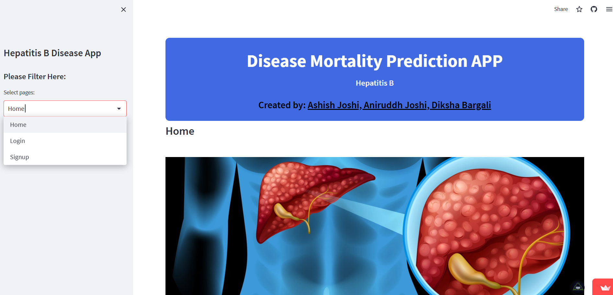
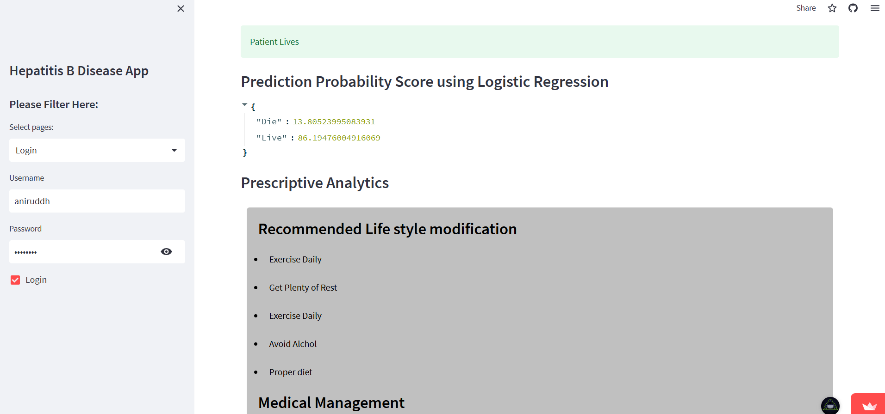

# Hepatitis-B-Disease-App

⚕️ **Hepatitis-B-Disease-App**: A productionized ML web application designed for precise prediction of Hepatitis-B mortality. This app leverages advanced machine learning models to provide users with accurate insights, supporting healthcare professionals and researchers. 🌐🤖

---

## 🌟 Features

- **Mortality Prediction**: Predict the likelihood of Hepatitis-B-related mortality with high accuracy.
- **User-Friendly Interface**: Intuitive and clean UI for seamless interaction.
- **Streamlit Framework**: Built with Streamlit for rapid deployment and ease of use.
- **Real-time Results**: Get predictions instantly after inputting data.

---

## 🖼️ Screenshots

### 1. **Home Page**
The welcoming interface where users can start the prediction process.

### 2. **Prediction Results**
A detailed view of the prediction output based on user inputs.

---

## 🚀 How to Use

1. **Visit the App**: [Hepatitis-B-Disease-App](https://trio-main-hepatitis-b-app-k7yussbdiha9hmwwgc3ztl.streamlit.app/)
2. **Enter Patient Data**: Fill in the required fields with relevant patient information.
3. **Get Predictions**: Click the "Predict" button to view the results instantly.

---

## 🛠️ Tech Stack

- **Frontend**: Streamlit
- **Backend**: Python
- **Machine Learning**: Scikit-learn, Pandas, NumPy
- **Deployment**: Streamlit Cloud

---

## 📷 Adding Images
To include the images in your project:

1. Create a folder named `images` in your project directory.
2. Add your images (e.g., `homepage.png` and `results.png`) to the `images` folder.
3. Ensure the paths in the README match the image file names and locations.

---

## 🤝 Contributing

We welcome contributions! Feel free to fork the repository, make changes, and submit a pull request. Let’s make healthcare prediction tools even better together! 🌟

---

## 📝 License

This project is licensed under the MIT License. See the [LICENSE](./LICENSE) file for details.

---

## 📬 Contact

For any inquiries or suggestions, feel free to reach out:

- **Creator**: Aniruddh Joshi
- **Email**: [aniruddh.joshi2904@gmail.com](aniruddh.joshi2904@gmail.com)
- **Website**: [[Hepatitis-B-Disease-App](https://trio-main-hepatitis-b-app-k7yussbdiha9hmwwgc3ztl.streamlit.app/)](https://trio-main-hepatitis-b-app-k7yussbdiha9hmwwgc3ztl.streamlit.app/)

---

💻 Empowering healthcare with **Hepatitis-B-Disease-App**! ⚙️🤖
